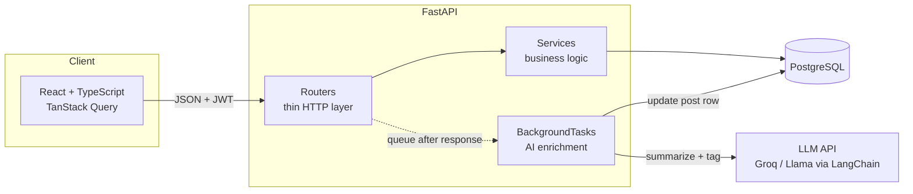

# DevLog — AI-Powered Social Blogging Platform

A full-stack social blogging platform where every post gets an **AI-generated TL;DR and topic tags** — automatically, in the background, without ever blocking the author. Built with FastAPI, PostgreSQL, LangChain, and React.

## Features

- 🔐 **JWT authentication** — register/login, bcrypt-hashed passwords, 30-minute tokens, protected routes
- ✍️ **Post CRUD** with strict ownership rules (only authors can edit/delete)
- 👥 **Follow system** — follow/unfollow users, follower/following lists with counts
- 📰 **Personalized feed** — paginated, newest-first posts from people you follow
- ✨ **AI enrichment** — every new post gets a 2-3 sentence summary and 3-5 topic tags via LangChain (Groq / Llama, swappable to OpenAI/Anthropic with one line of config), generated in a background task so post creation is never blocked by the LLM
- 🏷️ **Tag search** — GIN-indexed PostgreSQL array queries
- 🧪 **36 pytest tests, 88% coverage** — real PostgreSQL test DB, mocked LLM
- 🐳 **Dockerized** — one `docker compose up` for the whole stack

## Architecture



The key flow: `POST /api/posts` writes the post and returns **201 immediately**. The AI enrichment runs *after* the response is sent — if the LLM is slow or down, the post still exists and `summary`/`tags` stay null until the next regeneration.

## Tech stack

| Layer | Technology |
|---|---|
| API | FastAPI, Pydantic v2, pydantic-settings |
| ORM / DB | SQLAlchemy 2.0 (typed `Mapped` style), PostgreSQL 16 |
| Auth | python-jose (JWT HS256), passlib + bcrypt |
| AI | LangChain (`langchain-groq`, Llama 3.3 70B), structured output |
| Frontend | React 18, TypeScript (strict), Vite, TanStack Query, React Router, Axios |
| Testing | pytest, pytest-cov, FastAPI TestClient |
| Infra | Docker multi-stage builds, docker-compose, nginx |

## API summary

| Method | Endpoint | Auth | Description |
|---|---|---|---|
| POST | `/api/auth/register` | — | Create account (409 on duplicate) |
| POST | `/api/auth/login` | — | OAuth2 form login → JWT |
| GET | `/api/users/me` | ✅ | Current user |
| POST | `/api/posts` | ✅ | Create post (queues AI enrichment) |
| GET | `/api/posts/{id}` | — | Read post (incl. summary + tags) |
| PUT / DELETE | `/api/posts/{id}` | ✅ owner | Edit / delete own post (403 otherwise) |
| POST | `/api/posts/{id}/regenerate-ai` | ✅ owner | Re-run AI (rate-limited, 60 s/post) |
| GET | `/api/posts/search?tag=x` | — | Tag search (GIN index) |
| GET | `/api/users/{username}/posts` | — | User's posts, paginated |
| POST / DELETE | `/api/users/{username}/follow` | ✅ | Follow (400 self, 409 dup) / unfollow |
| GET | `/api/users/{username}/followers` `/following` | — | Lists with counts |
| GET | `/api/feed` | ✅ | Posts from followed users, newest first |
| GET | `/api/health` | — | Health check |

All list endpoints share one pagination contract: `?limit=` (≤50) `&offset=` → `{"items": [...], "total": N, "limit": L, "offset": O}`.

## Getting started

### Option A — Docker (one command)

```bash
cp backend/.env.example backend/.env
# edit backend/.env: set SECRET_KEY (openssl rand -hex 32) and GROQ_API_KEY

docker compose up --build
```

- Frontend: http://localhost:5173
- API + Swagger docs: http://localhost:8000/docs

### Option B — manual local dev

**Prereqs:** Python 3.12+, Node 20+, PostgreSQL running locally.

```bash
# Database
psql -d postgres -c "CREATE ROLE devlog WITH LOGIN PASSWORD 'devlog';" \
                 -c "CREATE DATABASE devlog OWNER devlog;"

# Backend
cd backend
python3.12 -m venv .venv && source .venv/bin/activate
pip install -r requirements.txt
cp .env.example .env        # then set SECRET_KEY and GROQ_API_KEY
uvicorn app.main:app --reload

# Frontend (second terminal)
cd frontend
npm install
npm run dev                  # http://localhost:5173
```

### Running tests

```bash
psql -d postgres -c "CREATE DATABASE devlog_test OWNER devlog;"   # once
cd backend
.venv/bin/python -m pytest tests/ -v --cov=app --cov-report=term-missing
```

36 tests, 88% coverage. The LLM is mocked — tests never call a real API.

## Screenshots

<!-- TODO: add screenshots -->
| Feed | Post with AI summary | Profile |
|---|---|---|
| _screenshot_ | _screenshot_ | _screenshot_ |

## Design decisions

**Why BackgroundTasks for AI enrichment.** An LLM call takes 1–10 seconds and depends on a third party. Calling it synchronously inside `POST /api/posts` would make authors wait and would couple publishing to Groq's uptime. Instead the post is committed and returned first; enrichment runs after the response, opens its own DB session, and swallows all errors — worst case a post has no summary, never a failed publish. The honest limitation: BackgroundTasks is in-process (no retries, no durability across restarts, no backpressure). For production volume I'd move enrichment to Celery + Redis; the service function wouldn't change, only who calls it.

**Why JWT (and not server-side sessions).** The API is stateless: any instance can verify a token with just the shared secret — no session table, no sticky sessions, horizontal scaling for free. Tokens carry only `sub` (user id) and `exp` (30 min), signed with HS256. Trade-off acknowledged: JWTs can't be revoked before expiry; the short lifetime bounds that risk. Passwords are bcrypt-hashed, login returns identical 401s for wrong-user and wrong-password (no account enumeration), and responses are serialized through Pydantic schemas that simply don't have a password field.

**Pagination approach.** limit/offset with a shared `Page[T]` generic schema, capped at 50 per page. It's the right fit at this scale and supports "jump to any page" trivially. Known weakness: `OFFSET n` scans-and-discards n rows, so deep pages get slow, and concurrent inserts shift page boundaries. A production feed would use cursor (keyset) pagination — `WHERE (created_at, id) < (cursor)` with a matching index — which is O(page size) at any depth. Listed under future work; the seam is isolated in the service layer.

**Tags as a PostgreSQL array (not a Tag table).** Tags here are AI-generated per-post metadata, not first-class entities — nothing renames or merges them globally. `ARRAY(VARCHAR)` + a GIN index gives indexed containment search (`tags @> ARRAY['python']`) with zero joins. If tags ever need their own pages/counts, that's a one-time backfill into a proper table.

**Real PostgreSQL in tests (not SQLite).** The schema uses `postgresql.ARRAY` — SQLite can't even create it. Testing against the production engine also exercises real dialect behavior (timezone-aware timestamps, composite PKs) instead of a lookalike.

## Future work

- 💬 Comments and likes
- ⏩ Cursor-based pagination for the feed
- 🔁 Celery + Redis for AI jobs (retries, backpressure, durability)
- 🔍 Semantic search — pgvector embeddings over post content
- 🔑 Refresh tokens / token rotation
- 📊 Alembic migrations (currently `create_all` + manual DDL)

## Deploying (free/cheap)

**Backend + DB → [Render](https://render.com)** (or Railway — same idea):

1. Create a **PostgreSQL** instance (free tier). Copy the internal connection string.
2. Create a **Web Service** from this repo, root `backend/`, environment **Docker**.
3. Set environment variables:
   - `DATABASE_URL` — Render's postgres connection string
   - `SECRET_KEY` — `openssl rand -hex 32` (never the dev default; store as a Render secret)
   - `GROQ_API_KEY` — from console.groq.com
   - `CORS_ORIGINS` — `["https://your-app.vercel.app"]`

**Frontend → [Vercel](https://vercel.com)** (or Netlify):

1. Import repo, set root to `frontend/`, framework Vite.
2. Set `VITE_API_URL=https://your-backend.onrender.com/api`.
3. Add a SPA rewrite (all routes → `/index.html`) — `vercel.json`: `{"rewrites": [{"source": "/(.*)", "destination": "/index.html"}]}`.

**Production changes checklist:**
- `CORS_ORIGINS` — only your real frontend origin, never `*` with credentials
- `SECRET_KEY` from a secret manager, never committed; rotate if leaked
- Free-tier Postgres pauses/expires (Render: 90 days) — mind the demo before interviews
- HTTPS everywhere (both platforms do this automatically)
- Swap `create_all` for Alembic before the schema evolves further
